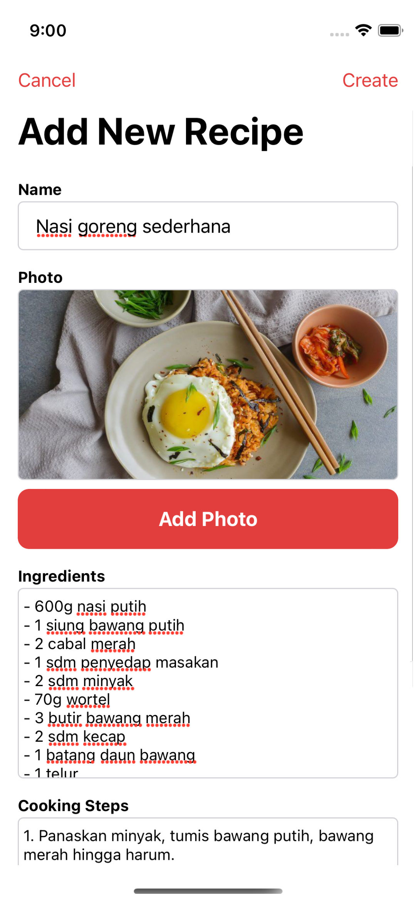

# Mamasak iOS App #
Mamasak is an application for writing recipes that can be used without internet, because the storage used is local storage, so you can add or edit recipes. and also this application can be used free of charge for anyone.

Mamasak was made because it was inspired by my mom, because sometimes she forgets about recipes and writes them down in a book. that's why Mamasak App is here. so that you can write all the recipes without fear of missing the recipe book, dirty recipe book, wet recipe book, etc.

### Screenshots ###
  

### Tech ###
* [Swift](https://developer.apple.com/swift/)
* [UIKit](https://developer.apple.com/documentation/uikit)
* [Core Data](https://developer.apple.com/documentation/coredata)
